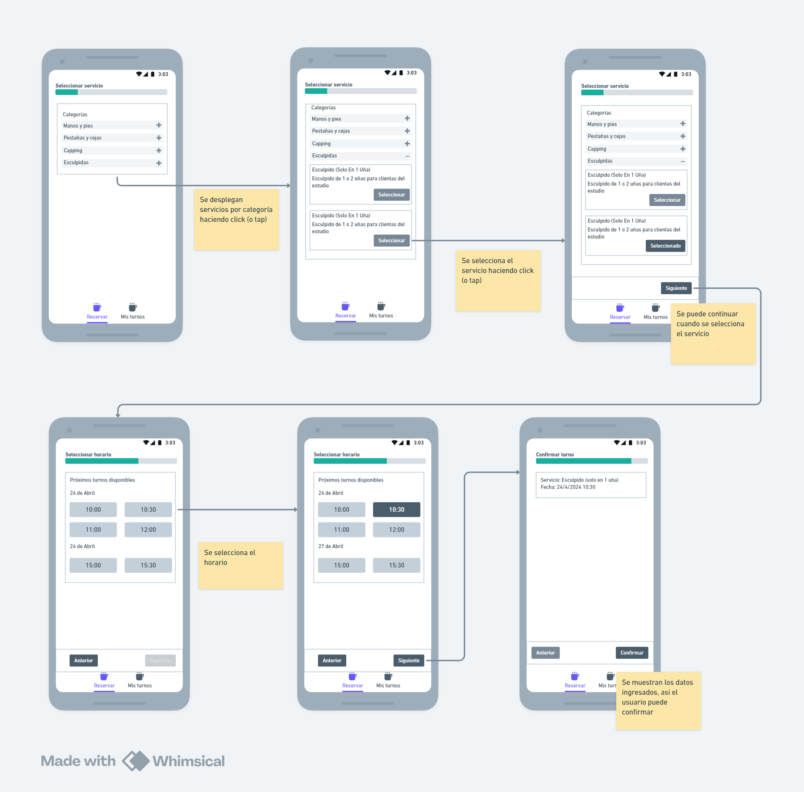

# Planify

## **Objetivo**

Crear una versión funcional pero simplificada de la página de reserva siguiendo el flujo proporcionado en los diseños. La tarea se centrará en desarrollar la interfaz de usuario y las interacciones necesarias para realizar una reserva.

### **Frontend**

- Construido con Vite: React y Typescript
- Css usando Tailwind CSS

### **Datos**
Para consumir los datos del archivo services.json se debe ejecutar
json-server --watch services.json

/services endpoint que obtiene todos los servicios
/slots endpoint que obtiene los horarios para los servicios

### **Proyecto**
Para desplegar el proyecto en un entorno local se debe:
    posicionarse en el directorio /planify
    correr npm run dev